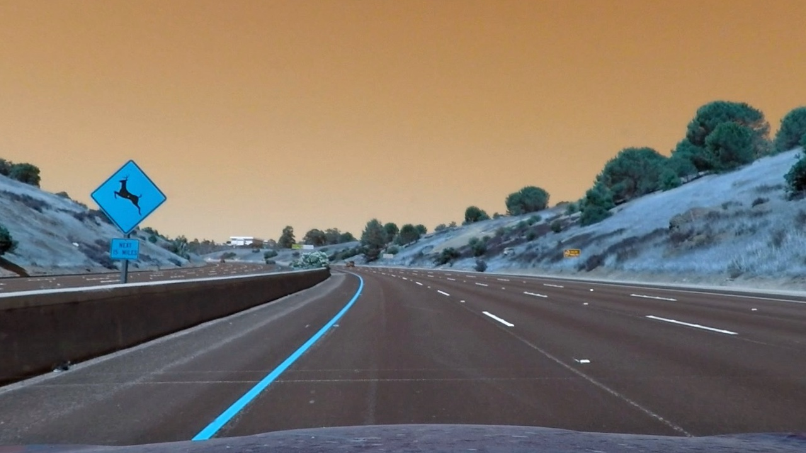
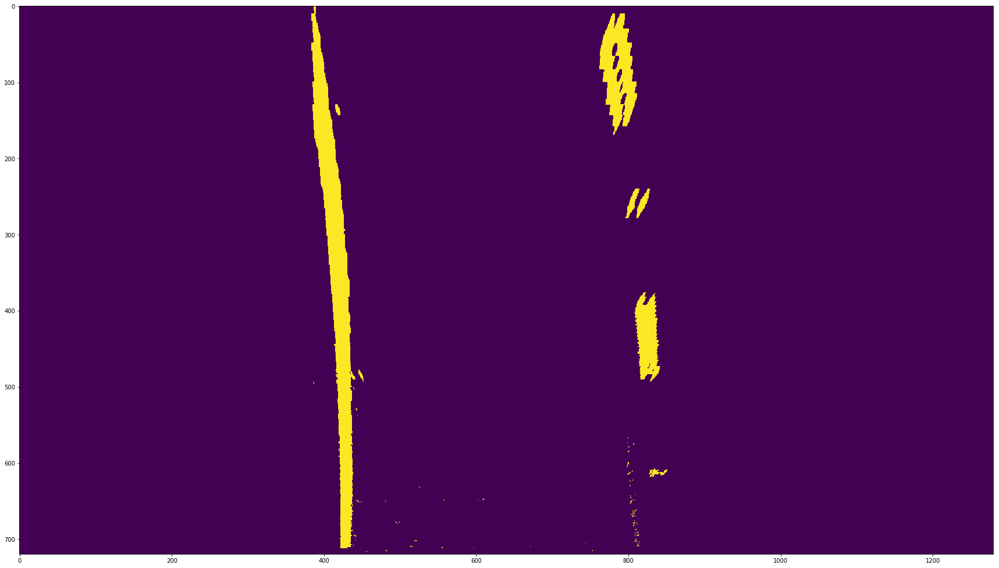

# Advanced Lane Finding

The Project
---

The goals / steps of this project are the following:

* Compute the camera calibration matrix and distortion coefficients given a set of chessboard images.
* Apply a distortion correction to raw images.
* Use color transforms, gradients, etc., to create a thresholded binary image.
* Apply a perspective transform to rectify binary image ("birds-eye view").
* Detect lane pixels and fit to find the lane boundary.
* Determine the curvature of the lane and vehicle position with respect to center.
* Warp the detected lane boundaries back onto the original image.
* Output visual display of the lane boundaries and numerical estimation of lane curvature and vehicle position.

Step 1 Camera Calibration
---

Camera needs to be calibrated to correct for distortions as the image. Chessboard test images provided are processed by the findChessboardCorners. Corner points on the test image are found and are used to calibrate the camera using the calibrateCamera() function.  

Step 2 Distortion Correction
---
The cal_distort function will take images passed in and undistort the image based on parameters from calibrateCamera

Example of distortion corrected image:

Step 3 Color transforms, gradient thresholded image
---
The basis of lane finding is to filter or threshold out the road and extraneous things from the image. This objective is achieved through using the L Channel and S Channel from HLS colorspace and V channel from the HSV colorspace. The thresholded images are combined using bitwise_and() and bitwise_or() functions to reduce as much residue from the lanes as much as possible. The images below are an example:

##### Original Image

##### Binary Image

---
Step 4 Perspective Transform
---
The perspective transform is performed by passing the image  that has been masked by a trapezoid into the function p_transform(). Within this function are two Opencv functions called getPerspectiveTransforr() and warpPerspective(). The first function finds the matrix that transform the source point on the image to destination points and the second function performs the transform.

##### Masked Image

##### Transformed Image

---
Step 5 Finding Lane Pixels and Polynomial fit
---
Histogram of the transformed image is takes along the x-axis to find the base of the two lines. The nonzero y and x coordinates found and the coordinates are windowed to organized into (x,y) coordinates for left line or right line. This is performed by the find_lane_pixels() function in the code. The polynomial fit is calculated by the fit_poly() function in code. The function uses numpy's polyfit() function to find the coefficients of a second degree polynomial. The windows and the polynomial are both onto the transformed image. The left line shown in red and right line shown in blue.

##### Polynomial Fit and Finding Lane Pixel Image

---
Step 6 Radius of Curvature and Offset from center
---
The radius of curvature is calculated using the measure_curvature_real() function in the code. The y and x values are converted into meters and ran the values through numpy's polyfit() function to get the radius of curvature in meters. The offset from the center of the camera position is calculated by taking the difference between the center of the image and midpoint between the left and right line.

##### Radius of Curvature and Offset from center

left curvature is 1393.33 m and right curve is 1393.33 m
Offset is 0.58 m

---
The Final Step
---
The final step is to draw the tracked lane back to the original image.

##### Final Step

Link to video: [video_result.mp4](./video_results.mp4)

---
Discussion
---
##### Problems and Issues
- One of the main issues was thresholding the image. If the image had strong daylight spread across the line, then the HLS colorspace, S channel, will likely cause the polynomial not to fit well.
- From the video, it is noticeable that when the car bounces the lane tracking becomes wobbly.
- The lane finding algorithm would likely to fail when...
     - The trivial case is when there are no line to detect or only one side of the lane is detected.
     - The lane line can't be approximated by a second degree polynomial.

##### Potential Improvements
- An improvement would be to have a way to select what colorspace to get the lane line.
- To average the lane lines over time.
